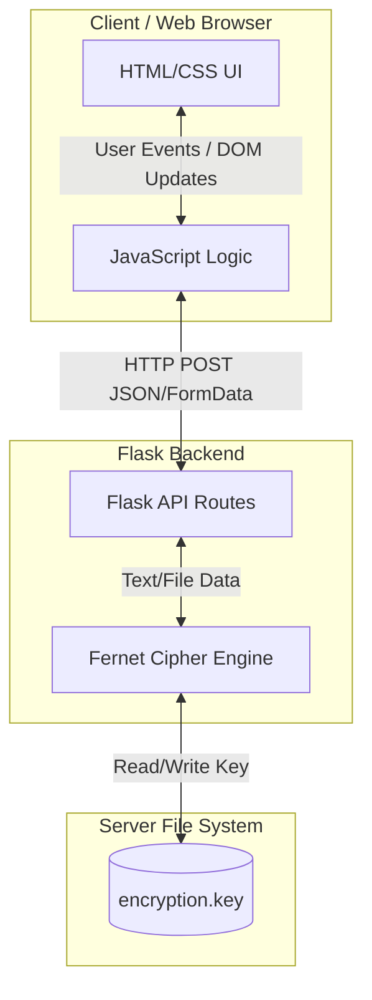
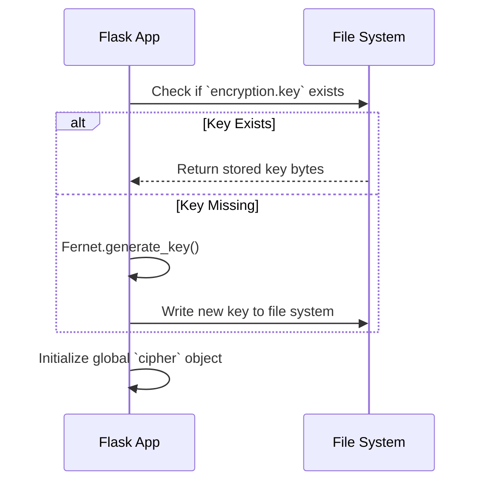
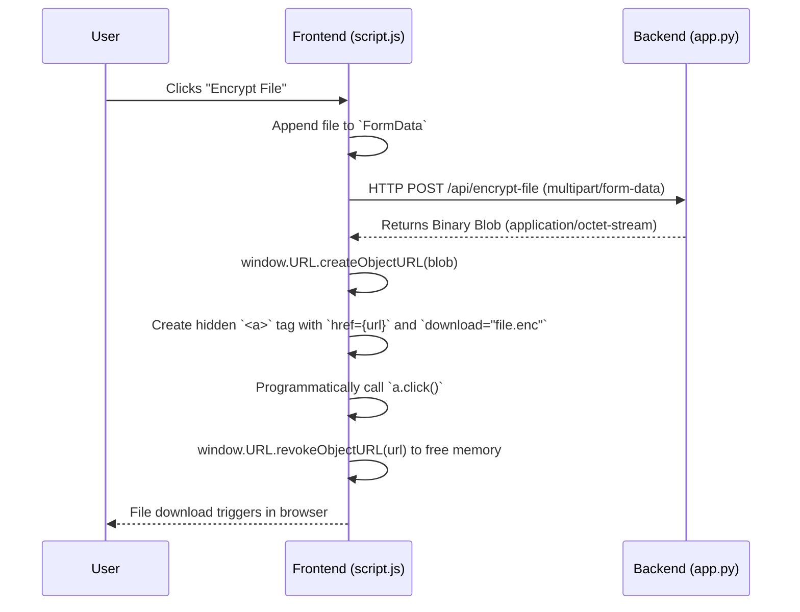

# Comprehensive Technical Report: Encryption & Decryption Tool

## 1. Executive Summary & Problem Statement

### The Problem
In an era where data privacy is paramount, users frequently need to transfer or store sensitive information (passwords, private messages, confidential files) securely. Using public, third-party encryption websites poses a significant risk, as users cannot guarantee that the server is not logging their plaintext data or storing copies of their uploaded files.

### The Solution
This project provides a **self-hosted, secure, and ephemeral encryption/decryption web application**. By utilizing the robustness of Python's `cryptography` library (specifically Fernet symmetric encryption), it ensures that data is encrypted using a local server-side key. 
- **Ephemerality:** The server processes the text or file in memory and immediately returns the result to the client. No data is stored or logged in a database.
- **Symmetric Encryption:** It uses **AES-128 in CBC mode** with a SHA256 HMAC message authentication code, providing both privacy and integrity checks.

---

## 2. Architecture Overview

The application follows a standard Client-Server architecture. The frontend is a Single Page Application (SPA) built with Vanilla HTML/CSS/JS, which communicates asynchronously via AJAX (`fetch`) to a Python Flask REST API backend.

---

## 3. Detailed Component Breakdown

### 3.1 Backend Logic (`app.py`)

The backend is driven by **Flask** and the **Cryptography** package.

#### A. Key Management

- **Functionality:** When the app starts, `load_or_create_key()` checks for an existing `encryption.key` file. If missing, it generates a securely random URL-safe base64-encoded 32-byte key. This key is used to build the global `Fernet` cipher instance.

#### B. Text Processing (`/api/encrypt-text` & `/api/decrypt-text`)
- **Encryption:** Accepts JSON containing plaintext. It encodes the string to bytes, passes it to `cipher.encrypt()`, and returns the ciphered text to the frontend.
- **Decryption:** Accepts the encrypted string. It attempts `cipher.decrypt()`. If the ciphertext was altered or belongs to a different key, the HMAC validation fails, raising an `InvalidToken` exception, which the server gracefully catches to return a `400 Bad Request`.

#### C. File Processing (`/api/encrypt-file` & `/api/decrypt-file`)
Instead of saving uploaded files to disk (which creates security risks and requires cleanup routines), the app processes files **in-memory** using `io.BytesIO`.
- **Encryption Flow:** The server reads the `FileStorage` object into bytes, encrypts it, writes it to a `BytesIO` buffer, and uses Flask's `send_file()` to stream it back as a downloadable `.enc` file.

#### D. Key Rotation (`/api/generate-key`)
Allows administrators to invalidate the old key and generate a fresh one. This immediately overwrites `encryption.key` and re-initializes the global `cipher` object, effectively locking out any previously encrypted data.

---

### 3.2 Frontend User Interface (`templates/index.html` & `static/style.css`)

The UI is built to be modern, responsive, and intuitive.

- **Layout Structure:** It uses centralized tab-pane logic. The HTML defines all five tabs (Text Encrypt, Text Decrypt, File Encrypt, File Decrypt, Key Management) upfront but hides inactive ones using CSS classes.
- **Styling highlights:**
  - Uses CSS Flexbox for centering and responsive button groups.
  - Implements a glassmorphism-inspired aesthetic with gradients (`linear-gradient(135deg, #667eea 0%, #764ba2 100%)`) and box-shadows.
  - Micro-interactions (hover states, focus rings on textareas, smooth `slideIn` animations for notifications) enhance the User Experience (UX).

---

### 3.3 Frontend Business Logic (`static/script.js`)

The JavaScript handles state management, network requests, and DOM manipulation without relying on external libraries like React or jQuery.

#### File Download Flow (The Challenge)
When downloading files via an async API (instead of a traditional form POST), the browser doesn't automatically trigger a "Save As" dialog. The JavaScript must handle the incoming binary stream.

#### Utility Functions
- **`switchTab()`:** Iterates through `document.querySelectorAll('.tab-pane')` to remove the `.active` class, then applies it only to the newly targeted tab.
- **`copyToClipboard()`:** Uses the modern `navigator.clipboard.writeText()` API, with a fallback to the older `document.execCommand('copy')` for maximum browser compatibility.
- **`showNotification()`:** A custom toast system that temporarily displays a success/error message and uses `setTimeout` to slide it out after 3 seconds.

---

## 4. Security & Limitations

### Why Fernet?
Fernet is a symmetric encryption recipe built on standard cryptographic primitives:
1. **AES:** Advanced Encryption Standard in CBC (Cipher Block Chaining) mode.
2. **PKCS7:** Padding to ensure block size conformity.
3. **HMAC:** Standard HMAC using SHA256 to ensure ciphertext integrity and authenticity. 

Because Fernet handles IV (Initialization Vector) generation, padding, and HMAC internally, it prevents common cryptographic implementation mistakes.

### Limitations & Recommendations for Production
1. **In-Memory File Constraints:** Because files are processed entirely in RAM using `read()`, an exceedingly large file could crash the Flask process via Out-of-Memory (OOM) errors. The code mitigates this by enforcing a hard `MAX_CONTENT_LENGTH = 16MB` limit defined in `app.config`.
2. **Transport Security:** For this application to be truly secure over a network, it **must** be served over HTTPS. Otherwise, the plaintext traffic between the browser and the server can be intercepted via a Man-in-the-Middle (MITM) attack.
3. **Server Setup:** The built-in Flask WSGI server is for development only. Deployments should wrap the app using a robust production server like `Gunicorn` or `uWSGI`, placed behind a reverse proxy like `Nginx`.
