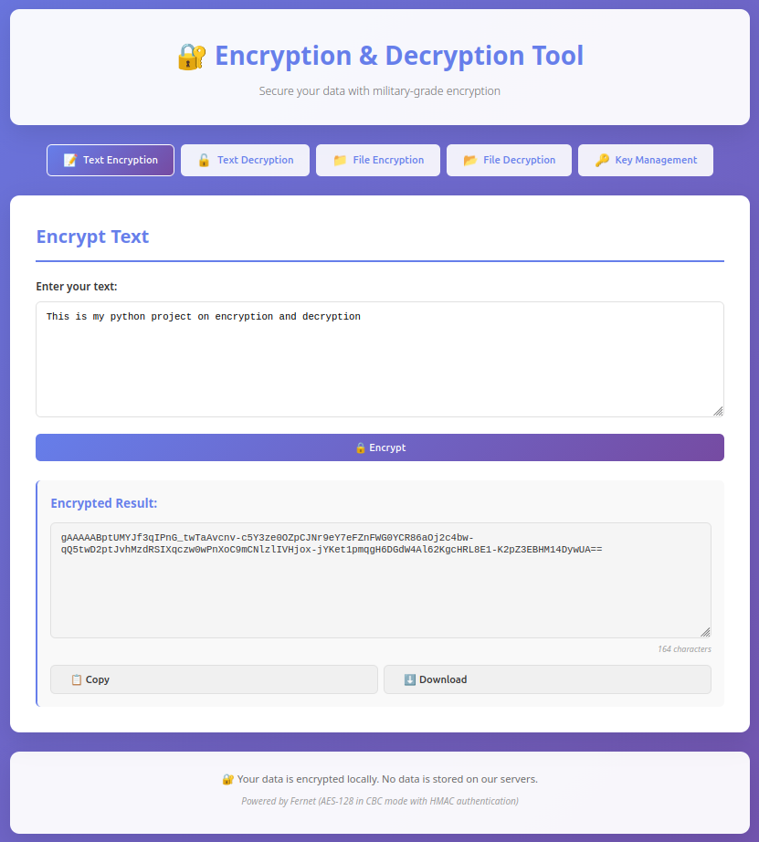
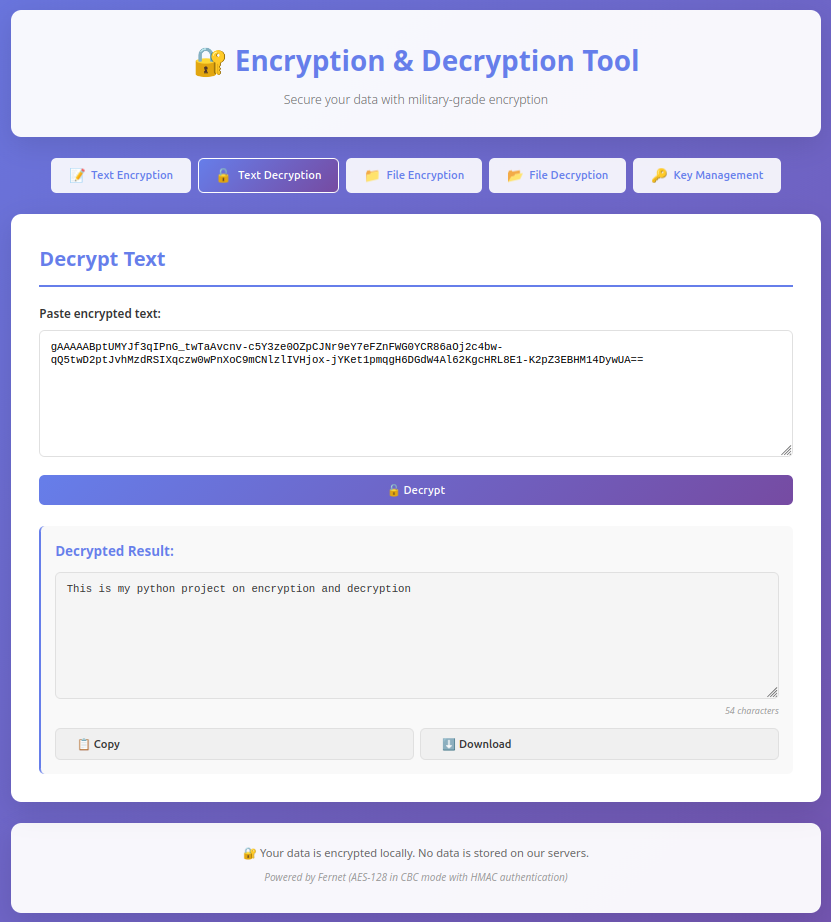

# 🔐 Encryption & Decryption Tool

A sleek, browser-based encryption/decryption tool built with **Python Flask** and **Fernet (AES-128)** symmetric encryption. Encrypt and decrypt both text and files directly from your browser — no data is ever stored on any server.

---

## 📸 Screenshots

### Text Encryption


### Text Decryption


### File Encryption


### Encrypted File Example


### Decrypted File Example


---

## ✨ Features

- 🔒 **Text Encryption** — Encrypt any plaintext with a single click. Copy or download the result.
- 🔒 **Text Decryption** — Paste any Fernet-encrypted ciphertext and decrypt it instantly.
- 📁 **File Encryption** — Upload any file (up to 16MB) and download an encrypted `.enc` version.
- 📂 **File Decryption** — Upload a `.enc` file and download the original.
- 🔑 **Key Management** — View key info and rotate the server encryption key.
- 📋 **Copy to Clipboard** — One-click copy of encrypted/decrypted output.
- ⬇️ **Download Output** — Download results as text files.

---

## 🛠️ Tech Stack

| Layer | Technology |
|-------|-----------|
| Backend | Python 3.11, Flask |
| Encryption | `cryptography` — Fernet (AES-128-CBC + HMAC) |
| Frontend | HTML5, Vanilla CSS, Vanilla JS |
| Container | Docker |

---

## 🚀 Getting Started

### Option A — Run with Docker (Recommended)

> **Prerequisites:** [Docker](https://www.docker.com/get-started) installed.

```bash
# 1. Clone the repo
git clone https://github.com/ashishMenon05/Encrypt-Decrypt---TOOL.git
cd Encrypt-Decrypt---TOOL

# 2. Build the Docker image
docker build -t encryption-tool .

# 3. Run the container
#    The -v flag mounts a local folder so your encryption key persists across restarts
docker run -p 5000:5000 -v "$(pwd)/data:/data" encryption-tool
```

Open your browser at **http://localhost:5000** 🎉

> To run in the background (detached mode):
> ```bash
> docker run -d -p 5000:5000 -v "$(pwd)/data:/data" --name enc-tool encryption-tool
> # Stop it later with:
> docker stop enc-tool
> ```

---

### Option B — Run Locally (without Docker)

> **Prerequisites:** Python 3.9+

```bash
# 1. Clone the repo
git clone https://github.com/ashishMenon05/Encrypt-Decrypt---TOOL.git
cd Encrypt-Decrypt---TOOL

# 2. (Optional) Create a virtual environment
python -m venv venv
source venv/bin/activate      # On Windows: venv\Scripts\activate

# 3. Install dependencies
pip install -r requirements.txt

# 4. Run the app
python app.py
```

Open your browser at **http://localhost:5000** 🎉

---

## 📦 Dependencies

```
Flask>=3.1.0
cryptography>=44.0.0
Werkzeug>=3.1.0
```

Install all with:
```bash
pip install -r requirements.txt
```

---

## ⚙️ Configuration

The app reads the following **environment variables** (all optional):

| Variable | Default | Description |
|----------|---------|-------------|
| `ENCRYPTION_KEY_PATH` | `encryption.key` | Path to the Fernet key file |
| `FLASK_DEBUG` | `false` | Set to `true` to enable Flask debug mode |
| `PORT` | `5000` | Port the server listens on |

Example with custom config:
```bash
FLASK_DEBUG=false PORT=8080 python app.py
```

---

## 🔑 Encryption Key

- A **Fernet key** is automatically generated on first run and saved to `encryption.key` (or `ENCRYPTION_KEY_PATH`).
- When using Docker, mount a volume at `/data` so the key persists across container restarts:
  ```bash
  docker run -p 5000:5000 -v "$(pwd)/data:/data" encryption-tool
  ```
- ⚠️ **Never commit `encryption.key` to git** — it is listed in `.gitignore`.
- ⚠️ If you lose the key, **all encrypted data becomes permanently unreadable**.

---

## 📁 Project Structure

```
.
├── app.py                  # Flask backend — all API routes
├── requirements.txt        # Python dependencies
├── Dockerfile              # Docker build config
├── .dockerignore           # Docker build exclusions
├── .gitignore              # Git exclusions (includes encryption.key)
├── templates/
│   └── index.html          # Single-page HTML frontend
├── static/
│   ├── style.css           # All styles
│   └── script.js           # All frontend logic
└── screenshots/            # README screenshots
```

---

## 🔒 Security Notes

- The app runs as a **non-root user** inside Docker.
- `FLASK_DEBUG` is `false` by default — the Werkzeug debugger is never exposed in production.
- The encryption key is **never transmitted** to the browser or logged anywhere.
- For production deployment, replace the Flask dev server with **Gunicorn**:
  ```
  gunicorn --bind 0.0.0.0:5000 --workers 2 app:app
  ```

---

## 📄 License

MIT — free to use, modify, and distribute.
